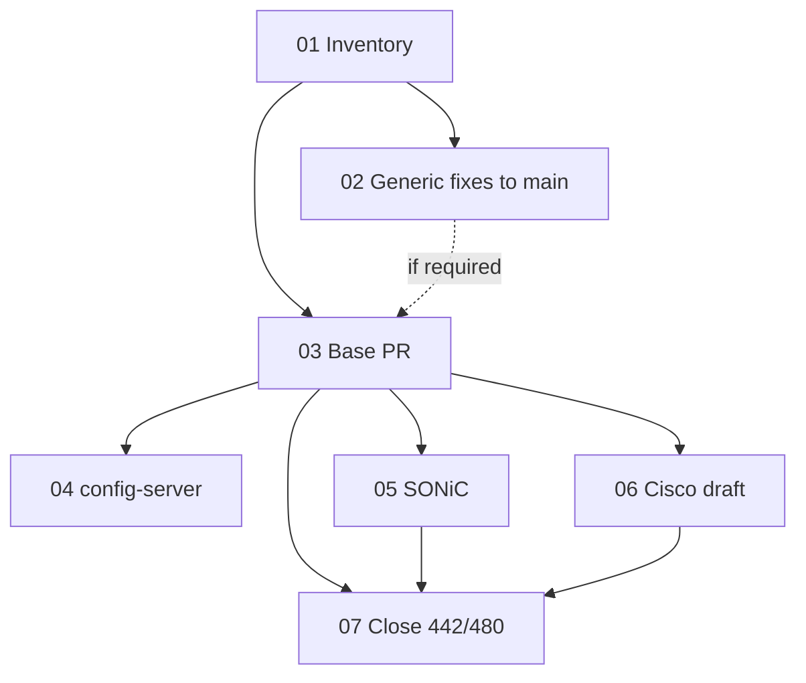

# Device-profile parallel stacks — ticket index

**Spec:** [`.scratch/open/10-device-profile-parallel-stacks-spec.md`](../open/10-device-profile-parallel-stacks-spec.md)  
**Parent:** [GitHub #504](https://github.com/sdcio/data-server/issues/504)

Delivery: **device-profile base** → parallel **SONiC** and **Cisco** NOS PRs (not stacked on each other). Protos: pin **sdc-protos#120** branch commit in base `go.mod` (no separate “merge protos first” ticket).

## Tickets

| # | Ticket | Blocked by | Status |
|---|--------|------------|--------|
| 01 | [Inventory legacy #442 / #480 commits](issues/01-inventory-legacy-442-480-commits.md) | — | done → [legacy-commit-inventory.md](legacy-commit-inventory.md) |
| 02 | [Land generic correctness fixes on `main`](issues/02-land-generic-fixes-on-main.md) | 01 | ready-for-agent |
| 03 | [Device-profile base PR](issues/03-device-profile-base-pr.md) | 01; 02 (if inventory requires) | ready-for-agent |
| 04 | [config-server: `deviceProfile` on base stack](issues/04-config-server-device-profile-on-base.md) | 03 | ready-for-agent |
| 05 | [SONiC NOS PR](issues/05-sonic-nos-pr.md) | 03 | ready-for-agent |
| 06 | [Cisco IOS-XR NOS PR (draft)](issues/06-cisco-ios-xr-nos-pr-draft.md) | 03 | ready-for-agent |
| 07 | [Supersede legacy PRs #442 and #480](issues/07-supersede-legacy-prs-442-480.md) | 03, 05, 06 | ready-for-agent |

## Dependency graph

## Frontier

Tickets whose blockers are satisfied now:

- **02** — Land generic fixes on `main` (see [inventory](legacy-commit-inventory.md) **main** rows)
- **03** — Device-profile base PR (inventory **base** rows + `df81f6f` split)

After **03** completes: **04**, **05**, **06** in parallel.

After **03**, **05**, and **06** PRs are open: **07**.

## Git branches (from spec)

| Branch | PR target |
|--------|-----------|
| `device-profile-base` | `main` |
| `sonic-device-profile` | base → `main` after base merges |
| `cisco-ios-xr-gnmi` | base → `main` (draft until lab-ready) |

## Out of scope (see spec)

Synced-gate #501, stacking SONiC on Cisco, enabling both profiles in one NOS PR, config-server E2E that assumes working NOS before the matching data-server PR merges.
