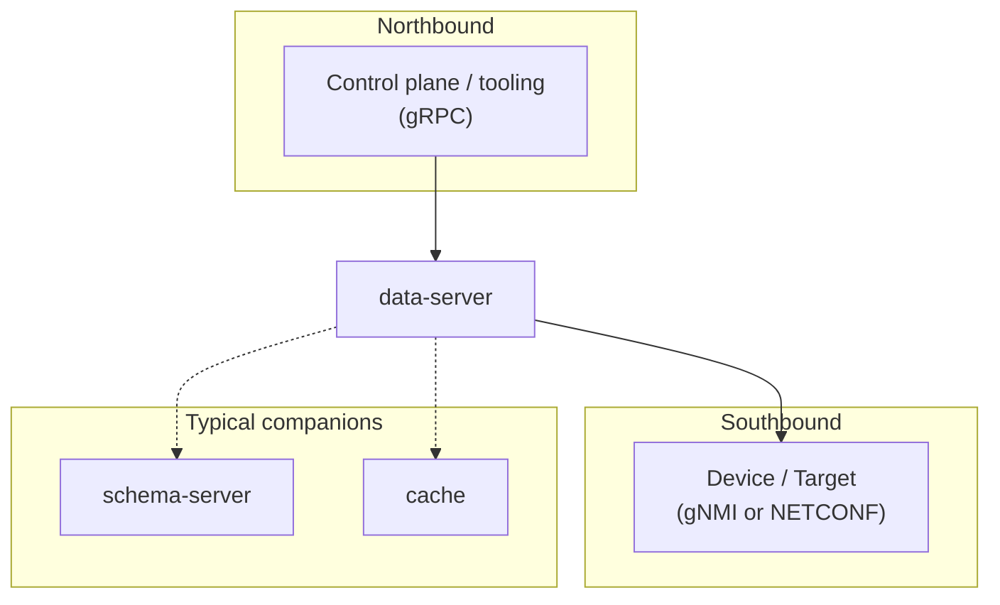

# SDC data-server

**data-server** is an intent-driven configuration engine for network automation that accommodates mixed operation: northbound **Intents** at explicit **priorities** merge into an effective tree together with **Running**—device configuration the datastore maintains through **Sync** (subscriptions, polling, or one-shot reads)—so CLI edits, Ansible, and other out-of-band changes share the same YANG-backed view as declarative automation. Schema binding is a hard requirement for interpreting and **validating** that tree; southbound drivers—for example **gNMI** or **NETCONF**—apply and refresh state without tying northbound callers to one protocol. Comparing merged intent expectations to **Running** produces **Deviations**; **revertive** intents re-converge on drift and **non-revertive** intents surface divergence without automatic re-push. **Owner** precedence and **blame** record who wins each leaf; **Transactions** follow confirmed-commit semantics with optional **dry-run**, then confirm or cancel/timeout rollback; where a published specification governs wire behaviour, it is the default interoperability contract unless this repository documents a deliberate exception.

Concretely, for each **Target**, **data-server** owns a **Datastore** that runs that merge, **Sync**, validation, apply, and rollback pipeline, with **gRPC** northbound for datastores, intents, transactions, deviation reporting, and introspection ([Northbound surface](docs/architecture.md#5-northbound-surface)). In [Schema Driven Configuration (SDC)](https://docs.sdcio.dev), it is the **southbound** component that materialises configuration on devices while integrating with **schema-server**, **cache**, and the rest of the platform.

**Where to read next**

- **Platform overview** — [docs.sdcio.dev](https://docs.sdcio.dev)

**Integration**

The primary **northbound** API is **gRPC** (datastores, transactions, intents, and schema-related usage—see [Northbound surface](docs/architecture.md#5-northbound-surface) in the architecture doc). data-server is **not limited to Kubernetes or config-server**: any control plane that can use those RPCs and supply the configured dependencies can run or embed it; schema and southbound contracts are documented in-repo rather than implied by a specific orchestrator layout.

## System context

Northbound callers use **gRPC**; southbound is **gNMI** or **NETCONF** to the **Target**. Schema and intent storage are usually backed by separate **schema-server** and **cache** deployments (or equivalents), as laid out in [docs/architecture.md](docs/architecture.md#2-system-context).

## Related repositories

| Repository | Role |
|------------|------|
| [sdcio/sdc-protos](https://github.com/sdcio/sdc-protos) | Shared **gRPC** / protobuf contracts (`data.proto` and related APIs). |
| [sdcio/schema-server](https://github.com/sdcio/schema-server) | Compiled YANG → **SDCPB** (and related) schema consumed by data paths. |
| [sdcio/cache](https://github.com/sdcio/cache) | Intent blob storage and retrieval used in typical layouts. |
| [sdcio/yang-parser](https://github.com/sdcio/yang-parser) | YANG parsing utilities used alongside the tree and validation stack. |
| [sdcio/goyang](https://github.com/sdcio/goyang) | **goyang** fork referenced from this module’s `go.mod` `replace` directive. |
| [openconfig/ygot](https://github.com/openconfig/ygot) | **ygot** (generated / structural helpers) as pulled in by this codebase. |
| [sdcio/config-server](https://github.com/sdcio/config-server) | Reference SDC control plane that drives data-server over gRPC (not the only possible caller). |

## Toolchain

- **Go** — **1.25.0** (see [`go.mod`](go.mod) for the authoritative `go` directive and dependencies).
- **YANG / schema stack** — This service builds on **OpenConfig goyang** (via the **sdcio/goyang** fork in `go.mod`), **ygot**, **yang-parser**, and **schema-server** for compiled schema and metadata. It does **not** use **libyang** as a runtime dependency; do not assume libyang-specific semantics unless that changes in code and docs.

The **YANG compatibility matrix** in this README may later be mirrored or moved to [docs.sdcio.dev](https://docs.sdcio.dev); there is no requirement to do so for the current README-first rollout.

## YANG compatibility matrix

**Normative YANG** spans much more than this table: the IETF definitions in *[RFC 7950](https://datatracker.ietf.org/doc/html/rfc7950)* (YANG 1.0) and *[RFC 7951](https://datatracker.ietf.org/doc/html/rfc7951)* (YANG 1.1—including `pattern` **`invert`**, refined regex rules, and other subtleties) are the standards; this matrix is **product truth** for the **SDC datastore** path (**SDCPB** from **schema-server** + default **data-server** validators). It is **not** a claim of full RFC coverage for every type, encoding, and edge case.

**Compiled schema (southbound)** is the **SDCPB** / proto-shaped schema artefact produced by the YANG **compile pipeline** (typically **schema-server**), which data-server binds per **Datastore**—it is **not** “data-server parses arbitrary `.yang` at runtime” for that contract. **Value validation (default on)** means each **Yes** / **Partial** cell in the right column below is active unless you disable that check under [`validation-defaults`](#configuration) (see [Configuration](#configuration) for YAML keys). The struct layout is in [`pkg/config/validation.go`](pkg/config/validation.go).

**Legend:** **Yes** — reflected or enforced for the **common** paths we use in real deployments (still not a substitute for reading the RFCs when you rely on obscure constructs). **Partial** — deliberate gaps vs the full RFC feature surface, multi-repo ownership, or type-specific behaviour (see footnotes). **No** — not enforced in that column. **N/A** — not meaningful as instance validation here.

| Construct | Compiled schema (southbound) | Value validation (default on) |
|-----------|------------------------------|--------------------------------|
| **mandatory** | Yes | Yes |
| **leafref** | Yes | Partial¹ |
| **pattern** | Yes | Partial⁶ |
| **must** | Yes | Partial² |
| **length** | Yes | Partial⁶ |
| **range** | Yes | Partial⁶ |
| **min-elements / max-elements** (list) | Yes | Yes |
| **min-elements / max-elements** (leaflist) | Yes | Yes |
| **when** | Partial³ | No |
| **if-feature** | Partial³ | N/A |
| **deviation** (YANG) | Partial⁴ | No |
| **unique** | Partial⁵ | No |
| **ordered-by** | Partial⁴ | N/A |

**Footnotes**

1. **Leafref** resolution (including **identityref** keys and `current()` key predicates) is shared with **schema-server** / importer behaviour; deep caveats and fixes are tracked in the [must / leafref / identityref normalization PRD](docs/prd/must-leafref-identityref-normalization/PRD.md).
2. **Must** runs in the **yang-parser** xpath VM over compiled expressions from schema; identity / import-alias normalisation spans compile and runtime per the same PRD. Rare VM parse/eval errors may be handled without failing the transaction (see implementation logs).
3. **`when`** and **`if-feature`** are primarily **compile-time** concerns in the effective schema (**schema-server**); data-server does not run a separate **`when`** / **`if-feature`** validator pass in [`pkg/tree/ops/validation`](pkg/tree/ops/validation).
4. **Deviation** and **ordered-by** shape the effective schema and materialisation; data-server validates against the **compiled** result, not the raw deviation text, and does not treat **ordered-by** as its own validator.
5. **`unique`** — no dedicated **unique** row validator in the active dispatcher today; do not assume list **unique** is re-checked at instance validation unless a maintainer confirms schema mapping.
6. **Pattern, length, range (RFC vs this implementation):** **Pattern** — enforced in [`validatePattern`](pkg/tree/ops/validation/validation_entry_pattern.go) for leaf values wired as **`Field`** entries; the XSD-style expression is translated with [`yangPatternToGo`](pkg/tree/ops/validation/validation_entry_pattern.go) into a **Go RE2** regexp (best-effort, not every XSD facet). An **inverted** match is applied **only if** the compiled pattern object carries an invert flag (YANG 1.1-style metadata from the pipeline)—if your compile path never emits it, you will not get invert semantics even though the validator can consume it. **Length** — [`validateLength`](pkg/tree/ops/validation/validation_entry_length.go) applies **UTF-8 rune** counts to the **string** form used at validation time; that is **not** identical to every YANG `length` rule across *binary*, *hex-string*, unions, etc., unless values are represented consistently end-to-end. **Range** — [`validateRange`](pkg/tree/ops/validation/validation_entry_range.go) covers **integral** numeric families (`int8`–`int64`, `uint8`–`uint64`) for leaves and leaflists; other numeric types depend on SDCPB typing and **TypedValue** encoding.

---

*This matrix applies to **[data-server v0.0.69](https://github.com/sdcio/data-server/releases/tag/v0.0.69)**. Update the tag (and cells if needed) when validation or the schema contract changes materially.*

## Configuration

Server behaviour is driven by a YAML file (see the sample [`data-server.yaml`](data-server.yaml) in this repository). **Do not commit secrets**; keep credentials in environment-specific files or secret stores, not in copy-pasted examples.

### `validation-defaults`

Top-level `validation-defaults` supplies the default **Validation** block for datastores loaded from config (gRPC-created datastores currently receive the same defaults). Under `disabled-validators`, set a key to **`true`** to **turn off** that runtime check (all default to **`false`** = enabled):

| YAML key | Validator |
|----------|-----------|
| `mandatory` | Mandatory children / keys / choice branches |
| `leafref` | Leafref target existence and path resolution |
| `leafref-min-max-attributes` | Constraints tied to leafref-typed attributes on leaflists |
| `pattern` | Pattern / regex (leaf `Field` path; XSD→RE2 shim; see matrix **footnote 6**) |
| `must-statement` | `must` xpath evaluation |
| `length` | Length bounds (UTF-8 string semantics at validation; see matrix **footnote 6**) |
| `range` | Numeric range (integral types in validator; see matrix **footnote 6**) |
| `max-elements` | `min-elements` / `max-elements` for **lists** and **leaflists** (single toggle in config) |

Optional: `disable-concurrency: true` under `validation-defaults` changes how validation is scheduled internally.

### Prometheus metrics

If the `prometheus:` block is present in config, the process starts an HTTP listener on `prometheus.address` and exposes **`/metrics`** (Prometheus scrape format, including gRPC metrics when enabled). Example from [`data-server.yaml`](data-server.yaml): `address: ":56090"` → scrape `http://<host>:56090/metrics`.

## Development

- Contributor conventions, docs expectations, and PR notes: **[docs/development.md](docs/development.md)**.
- **Build:** `make build` → `bin/data-server` and `bin/datactl`.
- **Run:** `./bin/data-server --config <path-to.yaml>` (see `data-server --help`). Never put real credentials in files you commit or share—see [Configuration](#configuration).
- **Tests:** `make go-tests` or `go test ./...`; broader checks with `make test` (includes Robot). Heavy unit run: `make unit-tests` (generates mocks, race detector, coverage dir under `/tmp/sdcio/dataserver-tests/coverage`).

## Observability

- **Metrics:** when `prometheus` is configured, see [above](#prometheus-metrics).
- **Profiling:** the binary always starts Go **`pprof`** on **`http://127.0.0.1:6060/debug/pprof/`** (see [`main.go`](main.go)); bind is loopback-only.
- **Readiness:** there is no separate HTTP health file in this README; until bootstrap finishes, gRPC calls can fail with **unavailable** via the server’s ready gate (see [`pkg/server/server.go`](pkg/server/server.go)).

## Contributing

Use **[docs/development.md](docs/development.md)** for conventions, documentation touch points, and pull-request expectations. There is no separate `CONTRIBUTING.md` in this repository today.

## Join us

Have questions, ideas, bug reports or just want to chat? Come join [our discord server](https://discord.com/channels/1240272304294985800/1311031796372344894).

## License and Code of Conduct

**Licenses (SPDX):** [Apache-2.0](LICENSE) (code), [CC-BY-4.0](LICENSE-documentation) (documentation).

The SDC project is following the [CNCF Code of Conduct](https://github.com/cncf/foundation/blob/main/code-of-conduct.md). More information and links about the CNCF Code of Conduct are [here](code-of-conduct.md).
